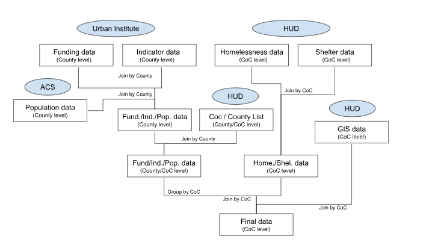
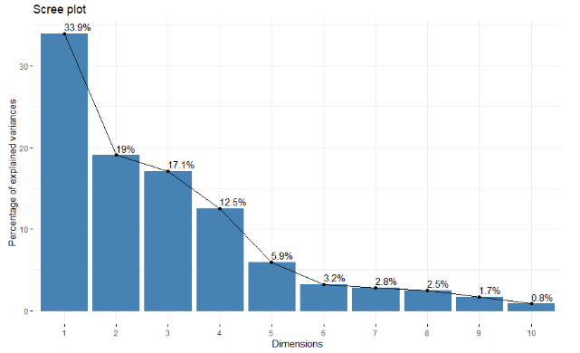
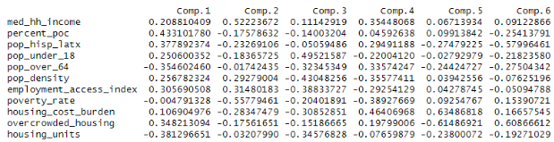

```{r setup, include=FALSE}
knitr::opts_chunk$set(echo = TRUE)
```

```{r load-packages, message=FALSE}
library(tidyverse)
library(openintro)
library(dplyr)
library(plotly)
library(sf)
library(rmapshaper)
library(scales)
library(weights)
library(htmlwidgets)
library(ggplot2)
```

### Abstract

  This project examines the relationship between federal housing funding and homelessness rates across U.S. Continuums of Care (CoCs) using 2024 data from HUD, the Urban Institute, and the American Community Survey. Through principal component analysis (PCA) and linear regression, we found that structural and demographic variables, particularly urbanization, racial diversity, and housing strain, were stronger predictors of where funding goes (adjusted R² = 54%) than of actual homelessness rates (adjusted R² = 33%). Visual analyses revealed that Black, American Indian/Alaska Native, and Native Hawaiian/Pacific Islander populations are consistently overrepresented in homeless populations, though no clear evidence showed unequal funding by race. Importantly, some affluent CoCs received more funding despite lower homelessness, while rural or economically disadvantaged areas with lower visibility received less, indicating a disconnect between funding allocation and actual need. These results suggest current funding strategies may reinforce existing disparities, highlighting the need for more equitable and data-sensitive policy approaches.


### Introduction

Homelessness and housing affordability are increasingly urgent issues in the United States, impacting individuals, communities, and broader social systems. In response, the federal government has allocated substantial funding to support homelessness prevention and housing programs through local Continuums of Care (CoCs). Homeless rates were on the decline in the United States from 2007 to 2016, with the percent of US citizens who were homeless falling by 15% in that time (AHAR 2024). However, since 2016, homelessness has seen a dramatic rise in prevalence, and ultimately in 2024, homelessness rates were 10% greater than they were in 2007 (AHAR 2024). With the deleterious effects of homelessness weighing on an increasingly large group of people, we think it is important to evaluate the funding that the federal government is putting forward to meet this issue and evaluate if that money is being distributed equitably and effectively.

This project investigates the relationship between federal housing funding and rates of homelessness across various CoCs using data from the U.S. Department of Housing and Urban Development’s 2024 Annual Homelessness Assessment Report (AHAR). The primary objective of this analysis is to evaluate whether higher levels of federal funding are associated with lower rates of homelessness. In addition, the study explores disparities in homelessness outcomes by racial group to assess whether funding is equitably distributed and effective across demographic subpopulations. Understanding the impact of federal investments is critical for informing future housing policy and resource allocation.


### Methods 

#### Data Collection: 
The data that was used for this project and analysis came from multiple sources. We started with data from the Urban Institute (UI) which includes a significant amount of data related to federal funded programs. UI collected funding information on all major IIJA and HUB programs from official websites and media announcements from various departments and agencies that administer these programs. There were a few criteria that UI used during the data collection. The major programs in HUD were defined as those who distributed at least \$1 billion in the fiscal years 2022 or at least $1 billion from 2022-2026 for IIJA. There were a total of 66 programs that met UI criteria and were included in the data. Within these 66 programs, jurisdictions needed to be identified, and lists needed to be compiled for every federal funded project in the fiscal years 2022. This was done using departmental press releases and supplemental research.

The data containing information about homelessness counts across CoC boundaries was taken from the U.S. Department of Housing and Urban Development's (HUD) 2024 Annual Homelessness Assessment Report (AHAR) to Congress, Part 1. The report is premised on data collected from the annual Point-in-Time (PIT) count made nationwide, approximating the homeless individuals on a single evening in January of every year. PIT count includes individuals living in emergency shelters, transitional housing, or safe havens, and living in unsheltered locations not intended for human habitation, such as streets, parks, and cars. Local Continuums of Care (CoCs), which are local planning organizations that are responsible for coordinating homelessness service delivery, administered the data through HUD-approved methods, including direct interviews and observational surveys. In addition to the PIT count, the Housing Inventory Count (HIC) was conducted to quantify the availability of shelter and housing resources. Together, these measures provide an accurate snapshot of homelessness across the United States, both the magnitude of the issue and community capacity to address it.


#### Merging Data: 
The research process began with an initial exploration of a dataset on federal infrastructure funding from 2022 to 2023 provided by the Urban Institute. This was done in order to understand its structure, variables, and the gaps that would need to be filled by external data sources. We chose to focus on two tables from this source: county indicators and country programs, which included information about federally funded infrastructure programs and community demographic data for county levels. There was some exploration done with the state data, but as there were only 52 observations, which was not enough to make a model. There was a significant amount of cleaning, restructuring, and merging that needed to be completed in order to build a dataset sufficient with the information necessary to answer the research question. There were many federally funded infrastructure programs in the initial data, but for the sake of answering our question, we kept the data related to housing programs only. We also kept about half of the indicator variables based on relevancy to housing, demographics, and job-related transit.  We supplemented UI’s data set with a more detailed breakdown of race and age demographics with a data set from the American Community Survey (ACS).
The additional data set that we chose to work with was the Department of Housing and Urban Development’s (HUD) 2024 Picture-in-Time (PIT) Counts for data on homeless individuals and the 2024 Housing Inventory Count (HIC) for data on temporary and permanent beds provided by local shelters for homeless people. The PIT and HIC data were on Continuum of Care (CoC) area levels, which is different from counties, so we joined the county-level data sets to a list containing CoCs and their assigned counties and aggregated all variables at the CoC level. We then joined the previously county-level data with the CoC-level data, to get our almost-complete data set. The last step was to join the large data set with GIS shapefiles.




#### Variables and EDA
Our variables of interest in our data exploration were homeless rate(%) and federal housing funding (dollars per capita). The initial exploratory data analysis examined a multitude of components within the data in order to determine any significant relationships between the other variables and the dependent variable. These relationships were examined in order to find ones which may be helpful predictors in a principal component analysis (PCA) and linear model using those new principal components. We first examined homeless rate and funding per capita on maps of the continental United States. Next, the relationship between homeless rate and funding per person were visualized using a scatterplot. This visualization prompted the exploration of many other variables that could be useful predictors for federal funding for housing per person such as racial demographics, social variables like overcrowded housing and age demographics of the population, and economic variables like median household income and the poverty rate of each CoC. The racial demographics for the homeless populations were visualized using maps. Additionally, density plots and bar plots were used to visualize any disparity between the proportion of each group in the homeless population versus the overall population. The racial groups included in our data were the same as those used by the United States Census Bureau; American Indian/Alaska Native, Asian, Native Hawaiian or Other Pacific Islander, Black, Multi, and White. The other social and economic variables that we investigated were also visualized on scatterplots and maps.

```{r shape files}
coc_data <- read_csv("coc_data (2).csv")
GIS <- sf::st_read("CoC_GIS_National_Boundary.gdb")
stupid_simple_GIS <- GIS |>
  rmapshaper::ms_simplify(keep = 0.001, keep_shapes = FALSE)
hud_gis <- stupid_simple_GIS |>
  right_join(coc_data, by = c("COCNUM" = "coc_num"))
hud_gis <- sf::st_cast(hud_gis, "MULTIPOLYGON")

```

```{r map of homeless rate}
p25 <- hud_gis |>
  filter(ST_1 != "AK", ST_1 != "HI", ST_1 != "PR", ST_1 != "GU", ST_1 != "VI", ST_1 != "MP") |>
  ggplot() +
  geom_sf(aes(fill = `Overall Homeless`/total_population,
              text = paste(coc_name,
                           '<br>Homeless rate: ', round((`Overall Homeless`/total_population)*100, digits = 2), "%"))) +
  scale_fill_gradientn(transform = "log10",
                       colours = c("lightgrey", "orange2", "blue4"),
                       name = "Homeless Rate",
                       labels = scales::percent_format()) +
  labs(title = "Homelessness in the United States - Continuum of Care View (2024)")

ggplotly(p25, tooltip = "text") |>
  style(hoveron = "fills")
```

```{r map of funding per person}
p7 <- hud_gis |>
  filter(ST_1 != "AK", ST_1 != "HI", ST_1 != "PR", ST_1 != "GU", ST_1 != "VI", ST_1 != "MP") |>
  ggplot() +
  geom_sf(aes(fill = fnd_per_person,
              text = paste(coc_name,
                           '<br>Funding per person: $', round(fnd_per_person), digits = 2))) +
  scale_fill_gradientn(transform = "log10",
                       colours = c("lightgrey", "orange2", "blue4"),
                       labels = scales::comma_format(prefix = "$"),
                       name = "Funding per Person<br>(USD)") +
  labs(title = "Federal Funding for Housing per Person - Continuum of Care View (2023)")

ggplotly(p7, tooltip = "text") |>
  style(hoveron = "fills")
```


####  Principal Component Analysis
We chose to perform a principal component analysis on our selected predictor variables because previous experimentation with linear regression suggested that many of our independent variables were collinear. The goal for this analysis was to be able to predict funding per person and homelessness rates. These two variables were excluded from being a part of any of the components. The data were standardized by setting the mean to 0, and each observation was replaced with its z-score. The variables that were included for the principal components analysis were:
  median household income (med_hh_income), 
  percentage of people of color (percent_poc), 
  percentage of Hispanic and Latin American (pop_hisp_latx), 
  percentage of the population that is under the age of 18 (pop_under_18), 
  percentage of the population that is over the age of 64 (pop_over_64), 
  population density (pop_density), 
  employment access index (employment_access_index), 
  poverty rate (poverty_rate), 
  share of population who pays ≥ 30% of their income to housing       (housing_cost_burden), 
  share of homes with an average of 2 or more people per room (overcrowded_housing),
  and housing units per capita (housing_units).

These variables were chosen based on their reliability as economic and demographic indicators for each CoC. Some nuance was lost including the variable percent_poc instead of rates for every race, but the loadings were too difficult to read when so many of the groups account for such a small share in the population that a relatively minor difference accounted for a massive shift in the principal components. Leaving the smaller racial groups out in favor of percent_poc allowed us to reduce the complexity of interpreting the loadings for each principal component, but this also comes at the cost of potentially missing valuable patterns related to homelessness and federal funding moderated by those smaller groups. We also elected not to include every age group in our PCA. Instead, we kept pop_under_18 and pop_over_64, but left out the age groups in the middle, assuming that the majority of them would have jobs and that the information contained in the other age groups could still be inferred from examining the “age bookends.”
  
#### Linear Models
There were six components that were used to generate a model to predict both federal funding per person and homeless rate. All of the components for both of these models were the same to ensure accurate and reasonable comparisons between the two models. These models were used to understand which categories and characteristics of CoCs lead to more federal funding and which are prone to higher homeless rates. The adjusted R-squared was used to interpret the variance that both of these models capture and whether or not federal funding was distributed equitably to CoC’s that were impacted by homelessness. Additionally, the coefficients for each component produced by these models were used to predict how much more funding a CoC would get per person or how much higher the homeless rate was in each CoC.


### Results

#### Racial Data
The research process began with an initial exploration of a dataset on federal infrastructure funding from 2022 to 2023 provided by the Urban Institute. This was done in order to understand its structure, variables, and the gaps that would need to be filled by external data sources. We chose to focus on two tables from this source: county indicators and country programs, which included information about federally funded infrastructure programs and community demographic data for county levels. There was some exploration done with the state data, but as there were only 52 observations, which was not enough to make a model. There was a significant amount of cleaning, restructuring, and merging that needed to be completed in order to build a dataset sufficient with the information necessary to answer the research question. There were many federally funded infrastructure programs in the initial data, but for the sake of answering our question, we kept the data related to housing programs only. We also kept about half of the indicator variables based on relevancy to housing, demographics, and job-related transit.  We supplemented UI’s data set with a more detailed breakdown of race and age demographics with a data set from the American Community Survey (ACS).
The additional data set that we chose to work with was the Department of Housing and Urban Development’s (HUD) 2024 Picture-in-Time (PIT) Counts for data on homeless individuals and the 2024 Housing Inventory Count (HIC) for data on temporary and permanent beds provided by local shelters for homeless people. The PIT and HIC data were on Continuum of Care (CoC) area levels, which is different from counties, so we joined the county-level data sets to a list containing CoCs and their assigned counties and aggregated all variables at the CoC level. We then joined the previously county-level data with the CoC-level data, to get our almost-complete data set. The last step was to join the large data set with GIS shapefiles.

```{r median gap bar plot}
ppp <- read_csv("ppp.csv")
ppp$race_better <- factor(ppp$race_better, levels = c("Native Hawaiian/Other Pacific Islander", 
                                                      "Black, African American, or African", 
                                                      "American Indian/Alaska Native", 
                                                      "White", 
                                                      "Multi-Racial", 
                                                      "Asian"))
ppp |>
  ggplot() + 
  geom_col(aes(x = race_better, y = median_scale_of_diff, fill = race,
               text = paste(race_better,
                            "<br>Median racial disparity gap: ", round(median_scale_of_diff, digits = 3)))) +
  theme(axis.text.x = element_text(vjust = .5)) +
  scale_x_discrete(labels = c("Native Hawaiian/\nOther Pacific\nIslander",
                              "Black, African\nAmerican, or\nAfrican",
                              "American Indian/\nAlaska Native",
                              "White",
                              "Multi-Racial",
                              "Asian"),
                   name = "Race Group") +
  scale_y_continuous(name = "Median Outcome Gap") +
  labs(title = "Racial Disparities In Homelessness",
       subtitle = "Gap is how many times more likely a given group is to be homeless than average homelessness rate for whole population") +
  scale_fill_discrete(guide = FALSE)

```


#### PCA Results
To better understand the underlying structure of the data and reduce dimensionality, we conducted a principal component analysis (PCA). This method allowed us to identify patterns in the dataset by transforming the original variables into a smaller set of uncorrelated components that explain the most variance. The results of the PCA highlight which variables contribute most strongly to the principal components and provide insights into groupings or trends within the data. 



We chose to use 6 principal components in our subsequent analyses because that was the lowest number of components that explained 90% or more of the cumulative proportion of the variance in our data.


  
The first principal component (PC1) appears to capture a contrast between urban, racially diverse areas and more suburban or rural, predominantly white areas with greater housing availability. High PC1 scores are associated with higher proportions of people of color and Latinx residents, elevated housing cost burdens, and lower per capita housing units suggesting urban density and housing strain. Conversely, low PC1 scores represent regions with more housing, whiter populations, and younger demographics.
  
The second component (PC2) reflects an economic gradient. CoCs with high PC2 scores tend to have higher median household incomes, more children, and lower poverty rates. In contrast, low PC2 scores indicate greater economic disadvantage, with fewer children and higher poverty and housing cost burdens. This dimension helps distinguish more affluent CoCs from those facing greater structural poverty.
  
The third component (PC3) differentiates CoCs by population density, age structure, and housing access. High PC3 scores are associated with lower density areas that have larger youth populations and weaker employment access. Low scores represent dense, older communities with more established infrastructure and better economic access.
  
The fourth component (PC4) contrasts older, rural CoCs with wealthier, Latinx populations against dense, impoverished urban areas. High scores represent aging populations with higher household income and lower poverty, while low scores indicate communities with greater density, housing cost burden, and poverty.
  
The fifth component (PC5) appears to capture a housing quality and crowding dimension. High PC5 scores are associated with high housing cost burdens but low overcrowding which are indicative of suburban or middle-income areas where housing is expensive but less cramped. Low PC5 scores point to areas with both high cost burdens and high overcrowding, suggesting acute housing pressure and affordability crisis.
  
The sixth component (PC6), which is only used in the model to predict homeless rate, highlights a demographic and overcrowding contrast. High scores on PC6 are seen in CoCs with predominantly non-Latinx, middle-aged populations experiencing overcrowding. In contrast, low scores tend to reflect Latinx communities that are younger and experience less overcrowding. This component likely picks up on cultural or household structure differences tied to both ethnicity and age.

#### Linear Regression 

To assess how these structural patterns relate to key outcomes, we used the PCA scores in two linear regression models. The first model regressed funding per homeless person on the first five principal components. These components were included in the model as they appeared to be statistically significant predictors based on an alpha of 0.05. Based on the adjusted R-squared values, this regression model predicted approximately 54% of the variance in the data. The model revealed that certain components, particularly those capturing urbanization and economic disadvantage, are significantly associated with funding levels.The coefficients for each component times the PCA score for that CoC determine how much additional funding each CoC receives.These values are reported in the results for each component. PC1 was a strong positive predictor of funding per homeless individual. CoCs which score high for this component which are typically urban areas with greater racial diversity, higher cost burdens, and fewer housing units received about \$20.07 more funding per person. PC2 revealed some conflicting results as it was also a strong positive predictor, but indicated that areas with a higher economic advantage received approximately \$20.58 more funding per person. The third component was a very significant predictor with a p-value of less than 2e^-16. The coefficient for this predictor was negative meaning that areas with denser populations and better employment access received \$46.76 less funding per person compared to areas with less dense and youth heavy communities. PC4, with a negative coefficient, was a statistically strong predictor with a p-value of less than 2e^-16. CoC’s that are older, more rural, and wealthier tended to receive \$47.40 less funding per person compared to CoC’s with populations that are more urban, poorer and have denser areas. The fifth component was another very significant predictor. The analysis indicated that CoC’s with higher housing cost burdens but lower overcrowding such as suburban or middle-income areas received \$26.11 more funding than CoCs with a lower score for this component. The sixth component, while not significant in this model, suggested that CoC’s with higher middle-aged, non-Latinx populations experiencing overcrowding may receive \$13.37 more funding per person. While this is a positive relationship, it is not statistically strong. The sixth component was kept in this model to ensure uniformity between the models for predicting federal funding per person and homeless rate.
  
For our second model, we used the same six principal components to predict homeless rates across CoCs. This linear regression model explained approximately 33.4% of the variance in homelessness rates based on the adjusted R-squared. Several components were significant predictors, offering insights into the structural factors associated with homelessness. PC1, which reflects urbanization, racial diversity, and housing cost burden, had a positive and significant relationship with homelessness rates. This suggests that more urban, racially diverse, and housing-strained CoCs tend to experience higher levels of homelessness, consistent with national patterns. PC3, which captures low population density, poorer employment access, and younger populations, showed a strong negative association with homelessness. This indicates that more rural or suburban areas may experience lower reported homelessness, possibly due to undercounting or differences in how homelessness manifests in these regions. PC4, representing the divide between aging, wealthier rural communities and dense, impoverished urban centers, was also positively associated with homelessness, further emphasizing the role of urban poverty. PC5, which contrasts overcrowded housing and cost burden, had a significant negative coefficient, meaning that lower PC5 scores, associated with both cost burden and crowding, are linked to higher homelessness rates. This supports the view that housing inadequacy, particularly crowding, is a structural driver of homelessness. PC6, which reflects a demographic pattern of non-Latinx, middle-aged populations in overcrowded conditions, also had a positive and significant effect, suggesting that these communities face elevated homelessness risk. Interestingly, PC2, which primarily reflects economic advantage (higher income, more children, lower poverty), did not significantly predict homelessness, implying that broader economic well-being alone does not necessarily protect communities from housing instability.

  
Comparing the two regression models reveals important differences in how structural factors relate to funding allocation versus actual homelessness rates. The model predicting funding per homeless person explained a greater proportion of variance (adjusted R-squared = 54%) than the model predicting the rate of homelessness (adjusted R-squared = 33%), suggesting that the variables captured by PCA align more closely with how funding is distributed than with homelessness prevalence itself. 


### Discussion

While there is a clear disparity in the homeless population compared to the overall population for many races, there was no data included in this analysis to indicate that one or more of these groups experienced disparity in receiving federal funding for housing. However when the variable percent_poc was used as a significant part of a component for the PCA, it was a positive predictor for both models, indicating that CoC’s with more racial diversity than others received additional funding per person, but were also more likely to have a higher homeless rate. This disparity was investigated and researched. Oftentimes funds are allocated based on surveys of communities to determine if there is a need for additional housing funding from federal institutions. According to a housing study done by Kithulgoda et al, the VI-SPDAT, a tool that is used to determine access to homelessness services and housing, leads to a significant amount of under-reporting for mental illness or incarcerations especially in Black individuals (Racial and gender bias in self-reported needs when using a homelessness triaging tool, pg. 4). The authors argue that solely relying on tools like this may unintentionally reinforce racial and gender inequalities and could be a reason for why minority groups struggle to escape homelessness.

Components tied to urbanization, racial diversity, and housing strain (PC1) were significant positive predictors in both models, indicating that more urban and housing-burdened CoCs both receive more funding and experience higher homelessness. However, PC2, representing economic advantage, was positively associated with funding but had no significant effect on homelessness rates, highlighting a potential mismatch as more affluent CoCs may be better positioned to secure funding regardless of actual need. Conversely, PC3, which captures rurality and low employment access, was negatively associated with homelessness but also linked to lower funding, suggesting that structurally disadvantaged but less visible CoCs may be underfunded. Other components, such as PC4 (urban poverty) and PC5 (housing inadequacy), were significant in both models, further reinforcing the importance of housing conditions and density. Altogether, these findings suggest that while funding decisions respond to some markers of structural need, they may not fully align with the underlying drivers of homelessness, pointing to possible inefficiencies or inequities in how federal resources are distributed across communities. 

While both models use the same structural components derived from PCA, they reveal different patterns in the underlying dynamics of homelessness and federal funding. The funding model appears more responsive to broadly visible markers of urban need, such as density, racial diversity, and income levels, whereas the homelessness rate model indicates that actual homelessness is more closely associated with housing system stress, including overcrowding, urban poverty, and inadequate housing supply. These results align with prior research by Vahidi et al. (2013), which found that socioeconomic indicators alone were insufficient to predict homelessness in Greater Vancouver, and that local contextual factors like housing availability and access to services, were critical determinants of homelessness rates . The divergence in our models suggests that while funding mechanisms may respond to administrative and demographic factors, they may not fully capture or prioritize the true structural drivers of homelessness. This disconnect can result in resource misalignment, where communities with acute housing crises receive less support than wealthier areas better equipped to navigate funding systems. These findings underscore the need to refine funding formulas to ensure they reflect not just general disadvantages but specific housing-related vulnerabilities that drive homelessness on the ground.

There are two variables that are often a driver for higher homeless rates which are not included in our data. This includes mental illness and substance abuse. Including these in our models to predict federal funding per person and the homeless rate may help to capture more of the variance within the data and the inequities shown by these two models may not be as significant. However, incorporating these factors could also have unintended consequences. As shown in the study by Fusaro et al. (2013), racial and ethnic minority groups are systematically overrepresented in the homeless population yet often face barriers to mental health diagnoses and care, which can affect how they are represented in datasets that rely on self-reports or administrative assessments like the VI-SPDAT. If such tools are used to determine service eligibility or funding prioritization, and minority groups are more likely to under-report or remain undiagnosed for mental illness or substance use disorders, this could exacerbate existing disparities. Instead of correcting for underlying need, these added variables may unintentionally reinforce structural biases, further diverting resources away from marginalized groups who already face disproportionate housing instability. As such, while expanding the model inputs may offer statistical improvements, it is essential to consider how data collection methods and diagnostic access may skew outcomes, especially when tied to funding decisions.


## The American Homelessness Crisis: Patterns, Causes, and Future Trajectories 
### Supplemental Research Done by Shukra 
#### Introduction 
The homelessness crisis in America is unlike anything we’ve seen before. In 2024, more than 771,000 individuals are experiencing homelessness, an alarming 18% increase from just a year earlier. It's clear that this issue goes far beyond personal misfortune or individual failings; it’s a reflection of deeper, systemic problems within our housing markets, social services, and economic systems.
From the sprawling encampments in California to the crowded shelters in New York and the coordination challenges faced in Kansas City, homelessness looks different depending on where you are. Yet, despite these regional differences, there are shared underlying causes that tell a more complex story.
This essay aims to delve into the multifaceted nature of homelessness in America, examining how structural economic factors intertwine with personal vulnerabilities. By looking closely at places like California, New York City, and Kansas City, we can uncover both the common threads and the unique challenges specific to each area. More importantly, by understanding these patterns, we can better anticipate future trends and explore effective solutions before the crisis worsens.

#### The Housing Market Foundation of Homelessness 

Homelessness is fundamentally tied to a significant failure in the housing market, and this issue is particularly glaring in California. The state faces a unique combination of geographic challenges, strict regulations, and local pushback that has led to a severe affordability crisis. Even middle-class families are feeling the pressure and facing housing instability. With home prices averaging around $775,000, much higher than in New York or Florida, it's clear that demand is way out of sync with supply, especially for affordable options across various income levels.
One of the key factors in this failure is the strong resistance to new housing projects, often seen in the form of local groups like NIMBYs ("Not In My Backyard") or the even more extreme BANANAs ("Build Absolutely Nothing Anywhere Near Anything"). These groups have learned to use zoning laws and environmental regulations to effectively block new construction. This resistance is often strongest in wealthier neighborhoods, resulting in a situation where affluent communities end up pushing their housing challenges into areas that are already struggling. This creates a ripple effect: when luxury units are not built in high-demand areas, wealthy individuals often move into middle-class neighborhoods, which then puts additional pressure on moderate-income families who are left hunting for scarce, low-quality housing.
California's geography only complicates the matter further. The state is filled with mountains, areas prone to wildfires, earthquake zones, and protected lands, which means that much of the development pressure is directed toward already expensive coastal cities and crowded inland valleys. Even implementing ideal policy changes wouldn’t resolve the housing shortage overnight since there’s just not enough buildable land close to major job centers, and what's available is often incredibly pricey.
The economic motivations of developers also skew the landscape. They tend to favor luxury housing because it offers higher profit margins, and navigating regulations for high-end projects is generally easier. On the other hand, the fees and regulations tied to affordable housing make it nearly impossible to build without significant subsidies. This creates a twisted scenario where the market ends up prioritizing what’s profitable over what’s truly needed, leading to an oversupply of luxury units in certain areas while working families struggle to find anything within their budget.

#### The Human Cost of Market Failure 

The abstract economics of housing markets can lead to truly devastating human consequences. Research has shown that even small rent hikes can push vulnerable families right into homelessness. When more than two-thirds of families are "rent-burdened," meaning they spend over 30% of their income on housing, many are left hanging by a thread. Something like a medical emergency, losing a job, or just a slight increase in rent can send families spiraling into homelessness.
This vulnerability isn't spread out evenly. The demographics of those experiencing homelessness reveal alarming trends: women and children of color are disproportionately affected, along with seniors, disabled individuals, and minimum-wage workers. These groups struggle to compete in housing markets where even the most basic living conditions come with sky-high prices due to limited availability.
The trauma of losing a home goes far beyond just being displaced. Kids who experience homelessness face disruptions to their education that can alter their entire future. Adults lose more than just shelter; they often lose their belongings, community ties, and a sense of security. The psychological toll of homelessness adds another layer of difficulty when it comes to finding new housing, creating a cycle that makes it even harder to break free from desperation.

#### Regional Variations in Crisis Managementn 

The housing market issues across the country are a big part of the homelessness crisis we see today, but if we look closely at the worst-hit areas,California, New York City, and Kansas City we can see they each have their own unique strategies for tackling this problem. These regions really show the complexity of the situation and how different policies can affect outcomes.
In California, we see what’s called the "unsheltered" model. About 70% of homeless individuals there live outdoors, in vehicles, or in encampments. This situation is partly due to the state's mild climate, which allows for outdoor living throughout the year, but it's also a sign of not enough investment in shelter facilities. The obvious visibility of homelessness in California leads to significant political pressure, but it also triggers NIMBY (Not In My Backyard) responses that complicate finding solutions. The state has focused on "Housing First" policies that prioritize permanent housing over temporary shelters, but the slow construction pace and high costs mean many are left without immediate options.
On the other hand, New York City operates under a very different model, often called "sheltered." Here, there’s a legal right to shelter, and the city currently houses over 72,000 people in its shelter system, a number that's climbing to record highs. However, this system has become more of a trap than a long-term solution. People are spending an average of 1.4 years in shelters if they’re single, and 1.5 years if they’re in a family, with actual housing placements at five-year lows. The massive bureaucracy in the city creates hurdles, even when help is available voucher programs are filled with red tape and issues that leave people stuck in shelters despite access to housing assistance.

Then there's Kansas City, which sheds light on the coordination challenges many cities face. Despite being a mid-sized metro area, it has one of the worst homelessness rates in the nation, with a staggering 95.7% of chronically homeless individuals unsheltered. This highlights how a lack of coordinated approaches can create severe issues, even where housing isn’t as expensive as in California or where the scale isn’t as large as New York City's. Local officials agree there’s enough funding to address the problem, but it’s not organized effectively. Kansas City focuses on building relationships and aims for "functional zero"getting anyone who becomes homeless back into stable housing within 30 days,but making this work is tough without a unified system in place.

#### The Individual Dimension: Mental Health, Addiction, and Trauma 

Homelessness is a complex issue that goes beyond just the visible signs of people living on the streets. While broader structural factors play a huge role in the extent of homelessness, individual circumstances are what often determine who falls into it, especially among vulnerable groups. It's striking to note that over 75% of chronically homeless individuals struggle with mental illness, and substance use disorders are equally prevalent. However, the relationship between these conditions and homelessness isn't as straightforward as many might think.
Starting in the 1950s, the deinstitutionalization of mental health care dismantled the state hospital system without providing enough community support as an alternative. This led to a significant drop in available psychiatric beds, essentially leaving many individuals with mental health issues stuck in a cycle of living on the streets, ending up in jail, or rushing to emergency rooms. This gap in care has created a persistent link between mental illness and homelessness that continues today.
Recent changes in the criminal justice system aimed at reducing incarceration for drug-related offenses have had unintended effects on this vulnerable population. While these reforms are crucial for justice, they also took away certain pathways to mandatory treatment that previously helped those struggling with addiction find recovery resources. Without programs like drug courts or diversion options, many individuals have lost access to the treatment they might not have pursued on their own.
It's also important to highlight that mental health and substance use issues often emerge as a result of homelessness rather than being the primary cause. The trauma of losing a home, living in unsafe environments, and facing social stigma can significantly worsen mental health conditions. Likewise, many individuals may start using substances as a way to cope with the stress and hopelessness that comes with being homeless. This perspective suggests that if we focus more on stabilizing housing situations, we could potentially prevent many of these individual crises from happening in the first place, rather than just trying to deal with the fallout.

#### Prevention as the Path Forward 

The most effective strategies for tackling homelessness are shifting towards prevention, rather than just reacting to crises. A great example of this is New York City's Partnership To End Homelessness. They focus on keeping families in their homes by covering their back rent,without any income requirements, while also offering trauma-informed support services. This approach costs about $3,300 for each household, which is a fraction of the staggering $44 billion it would cost to provide shelter for the 1.1 million New Yorkers currently behind on their rents.
What’s really important about the prevention model is that it understands that solving housing issues is more complex than just providing funds. The best programs not only resolve immediate crises but also tackle longer-term issues like trauma, mental health, and economic stability. This holistic viewpoint recognizes that families facing eviction often have to deal with a lot more than just financial struggles.
The success of these prevention initiatives highlights a key point: homelessness usually stems from temporary crises in the lives of otherwise stable families. Whether it’s a sudden medical issue, a job loss, or a family emergency, these situations can lead to rent arrears that spiral out of control, ultimately resulting in eviction. By stepping in during these critical times,before families lose their homes,we can be both more compassionate and more cost-effective than simply trying to manage the fallout of homelessness later on. 

#### Furture Projections and Emerging Trends 

Looking ahead to the future of homelessness in America, it’s clear that we're facing some significant challenges and changes. Let’s break it down over the next couple of decades.

Short-Term (2025-2030)  
In the next few years, things are likely to get worse before they get better. Housing costs are skyrocketing faster than wages in many cities, pushing more people towards the edge of losing their homes. On top of that, climate change is bringing about more natural disasters that can displace families and make it riskier for those who find themselves homeless, especially in areas that once seemed safe. The aftereffects of the COVID-19 pandemic are still felt, with the ending of emergency rental assistance causing a spike in evictions and housing instability.
However, there's potential for change. As younger politicians take on leadership roles, they might push for better housing policies and social services, reflecting the priorities of younger voters. That said, the usual political and regulatory hurdles will likely slow down any real progress. We’ll probably see more people experiencing homelessness in places with milder weather, while cities with harsher climates, like New York, will struggle to keep their shelter systems afloat under the pressure.

Medium-Term (2030-2040)  
Looking further ahead, from 2030 to 2040, we can expect technology and shifting demographics to reshape the homelessness landscape. Automation and AI have the potential to eliminate many low-skill jobs, creating new forms of economic instability that could put even more people at risk of losing their homes. Yet, these technologies might also help streamline services for those in need, making early intervention more manageable.
Climate change will drive more migration as people from disaster-prone areas move to safer locations, which will ramp up housing demand in already expensive cities, particularly in the West. This influx could overwhelm existing housing markets and social services, straining the systems that are already in place. With the increasing visible costs of homelessness,both economically and socially,there may finally be enough pressure on policymakers to start overcoming the resistance to building more housing. States may begin overriding local zoning restrictions like we’ve seen in California and Oregon, and we may even see the federal government stepping in more directly with spending initiatives.

Long-Term (2040-2050) 
By the time we hit 2040 to 2050, addressing homelessness in America will likely require deep, structural changes in housing policies and safety nets. Concepts like universal basic income could help tackle the extreme financial instability that leads to losing a home, while advancements in manufacturing might finally make affordable housing feasible without relying heavily on government subsidies.
That said, it’s important to recognize that the journey to these solutions will probably involve continuous struggles and setbacks. Political systems tend to change slowly, often because established interests are resistant to reforms that might disrupt property values or local governance. The most likely scenario is one of gradual improvement, but it’s going to take years of grappling with crises before we see meaningful solutions emerge from a mix of technological advancements, political pressure, and changes in the mindset of upcoming generations.

##### Regional Differentiation 

The situation surrounding homelessness varies significantly across the country, and it's clear that different regions are likely to adopt distinct strategies based on their unique challenges and political climates. For instance, California might take the lead in introducing technological solutions and innovative state policies, largely because of the high visibility of the crisis and the resources of its tech industry. In contrast, New York, with its complicated and often dysfunctional shelter system, may prioritize reforming its bureaucracy and improving coordination among services. Meanwhile, cities like Kansas City, which struggle with coordination issues, could become models for regional cooperation, potentially paving the way for other cities facing similar hardships.
The outcomes of these varying approaches in America's most challenging homelessness markets will serve as important real-world experiments. They could provide valuable insights into what strategies work best in different contexts, ultimately offering lessons for other cities and states trying to tackle homelessness.
One of the biggest hurdles to finding effective solutions lies in understanding the political dynamics and the economy surrounding housing and social services. There are many interests that benefit from the current state of affairs, which ironically incurs heavy social costs. Homeowners, for example, often resist new housing developments, fearing that increased supply might devalue their homes. This resistance is particularly strong among older, wealthier, and whiter voters who tend to dominate local politics and, unfortunately, this can stall progress even when broader public opinion favors change.
Moreover, the fragmented governance across different levels,local, state, and federal,creates significant coordination challenges. Local authorities control zoning but lack the resources for social services, while state governments have broader authority but struggle to compel local compliance. On a federal level, funding often comes with stipulations that can hinder effectiveness.
There are also professional and bureaucratic interests that may inadvertently work against necessary change. For example, social service agencies may prefer to stick with established funding methods rather than adopt performance-based approaches. Similarly, construction unions may back regulations that drive up labor costs, even when such rules inhibit housing production.
To move forward, we need to break down these traditional barriers and foster integration and innovation. One promising idea is the formation of regional housing authorities that can bypass local zoning restrictions while ensuring that infrastructure and services are adequately met. Another significant step would be the implementation of integrated data systems to track individuals across service providers, which can facilitate coordinated efforts and minimize bureaucratic red tape.
Additionally, embracing innovation in construction technology holds potential for reducing housing costs, but this requires reforming regulations that currently stifle new building techniques. For instance, prefabricated and modular construction could significantly lower costs and shorten construction timelines, yet they often run into resistance due to outdated building codes.
Ultimately, the most effective strategies will likely blend immediate relief efforts with long-term structural reform. Programs aimed at preventing evictions, coupled with advocacy for zoning reforms, can address both urgent individual crises and the underlying systemic issues. Integrating services that combine housing support with mental health resources, addiction treatment, and job training acknowledges the complex nature of homelessness while working towards sustainable solutions.

#### Conclusion: Crisis as Catalyst 

America's homelessness crisis is more about systemic failures than individual shortcomings. The housing market is twisted by a sense of artificial scarcity, while social services often end up scattered across competing agencies. Politically, the system tends to favor existing homeowners over the urgent need for new housing, creating a perfect storm of instability for those without homes.
However, crises like this can also spark change. The visible costs of homelessness,like the suffering it causes, the money it drains from public funds, and the social chaos it brings,are pushing for solutions that seemed off the table just a few years ago. States are starting to tackle local zoning laws, cities are trying out innovative service models, and more people are supporting both the construction of new housing and improved social services.
The next decade feels pivotal. It’s a time that could define whether we turn this crisis into a chance for meaningful reform. There are proven solutions out there,like prevention programs, streamlined housing production, and coordinated service efforts,but making them happen is tricky. We’ll have to navigate significant entrenched interests and bureaucratic hurdles. The key will be keeping our eyes on long-term solutions instead of just managing the immediate crisis.
This issue goes beyond just homelessness. A society that can’t shelter its most vulnerable members forces us to confront deeper concerns about economic fairness, social unity, and how we govern ourselves. Solving the homelessness crisis means tackling big questions about resource distribution, community decision-making, and our shared responsibilities to each other.
So, while the path forward seems straightforward,prioritizing prevention over reaction, choosing coordination over disarray, and pushing for sweeping reform instead of small tweaks,the challenge lies in keeping the political momentum alive long enough to see these comprehensive solutions through.
Ultimately, homelessness reflects broader issues in American life: stark inequality, dysfunctional institutions, and the ongoing tug-of-war between individual freedoms and collective obligation. Tackling these fundamental problems will require more than just a housing policy overhaul,it calls for a renewed commitment to ensuring that everyone is treated with dignity and has a right to security. Perhaps the crisis of homelessness will be the catalyst that drives us to reevaluate our values, leading to transformative changes not just in housing policy but in the very fabric of American society.


### Sources

Berube, A., & Hendey, L. (2024). Is federal infrastructure investment advancing equity goals? Urban Institute. https://www.urban.org/research/publication/is-federal-infrastructure-investment-advancing-equity-goals

Fargo, J. D., Munley, E. A., Byrne, T. H., Montgomery, A. E., & Culhane, D. P. (2013). Community-level characteristics associated with variation in rates of homelessness among families and single adults. American Journal of Public Health, 103(S2), S340–S347. https://pmc.ncbi.nlm.nih.gov/articles/PMC3969110/

Kithulgoda, C. I., Vaithianathan, R., & Parsell, C. (2024). Racial and gender bias in self-reported needs when using a homelessness triaging tool. Housing Studies, 39(8), 1951–1973. https://doi-org.ezproxy.spu.edu/10.1080/02673037.2022.2151986

Mago, V. K., Morden, H. K., Fritz, C., Wu, M., Dabbaghian, V., & Kawash, J. (2013). Analyzing the impact of social factors on homelessness: A fuzzy cognitive map approach. BMC Medical Informatics and Decision Making, 13, 94. https://doi.org/10.1186/1472-6947-13-94

U.S. Census Bureau. (n.d.). American Community Survey 5-year data (2009–2023). U.S. Department of Commerce. https://www.census.gov/data/developers/data-sets/acs-5year.html

U.S. Department of Housing and Urban Development. (2023). FY 2023 Continuum of Care (CoC) geographic code report. https://www.hud.gov/sites/dfiles/CPD/documents/CoC/FY-2023-GeoCodes-Report.pdf

U.S. Department of Housing and Urban Development. (2024). CoC homeless populations and subpopulations reports. HUD Exchange. https://www.hudexchange.info/programs/coc/coc-homeless-populations-and-subpopulations-reports/

U.S. Department of Housing and Urban Development. (n.d.). Continuum of Care (CoC) GIS tools. HUD Exchange. https://www.hudexchange.info/programs/coc/gis-tools/